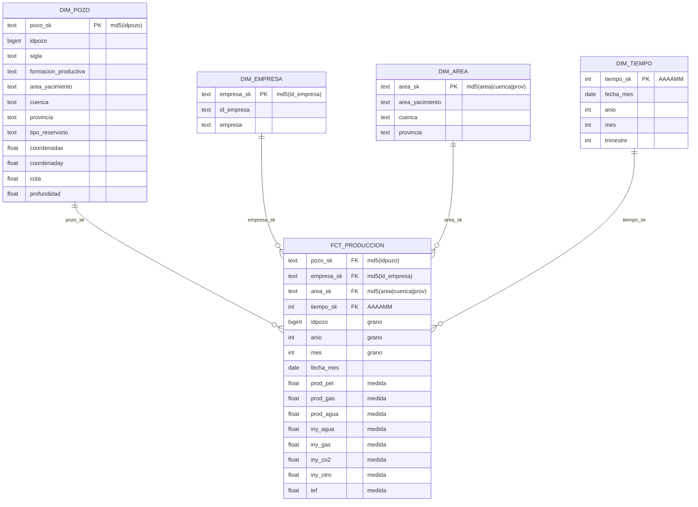

# ADR-017: Modelo dimensional (esquema estrella)

**Fecha**: 2026-06-11
**Estado**: Aceptado

## Contexto

La capa Gold debe exponer los datos listos para consumo de negocio (BI) y cumplir el requisito de la adenda de usar un **modelo estrella**, documentando **grano de la fact, dimensiones, surrogate keys y decisión de SCD**. La fuente principal es la producción mensual por pozo (Silver `stg_produccion`), complementada con el maestro de pozos (`stg_pozos`).

## Alternativas consideradas

- **One Big Table (OBT) / tabla ancha desnormalizada**: una sola tabla con producción + todos los atributos descriptivos repetidos en cada fila. Es simple de consultar (sin joins) y rápida para algunas herramientas de BI, pero repite los atributos del pozo/empresa/área en millones de filas y dificulta mantener consistencia.

- **Esquema copo de nieve (snowflake)**: dimensiones normalizadas en sub-tablas (ej. provincia -> cuenca -> área en tablas separadas con FKs entre sí). Ahorra algo de espacio y evita redundancia en las dimensiones, pero agrega joins en cadena que complican las consultas de BI para usuarios no técnicos, sin un beneficio claro a esta escala.

- **Esquema estrella**: una fact central rodeada de dimensiones desnormalizadas, una sola capa de joins. Es el estándar para analítica/BI, el más simple de consultar para usuarios no técnicos.

## Decisión

Se adopta un **esquema estrella** en el schema `gold`:

- **Fact `fct_produccion`** — grano: **una fila por `idpozo` × `anio` × `mes`** (verificado único en los datos). Medidas: `prod_pet`, `prod_gas`, `prod_agua`, inyecciones (`iny_*`) y `tef`. Incluye claves degeneradas (`idpozo`, `anio`, `mes`, `fecha_mes`).
- **Dimensiones**: `dim_pozo` (atributos del pozo), `dim_empresa` (operadora), `dim_area` (área/yacimiento, cuenca, provincia), `dim_tiempo` (mes).

**Surrogate keys**: se generan por **hash determinístico** (`md5` de la clave natural), no por secuencia/`row_number`. Razón: dbt reconstruye las tablas completas en cada corrida; un hash da siempre el mismo valor, de modo que la fact puede **recalcular** la misma SK desde sus columnas y matchear la dimensión sin lookups ni riesgo de reasignación. `dim_tiempo` usa una *smart key* `AAAAMM` por legibilidad.

**SCD**: se usa **SCD Type 1** (las dimensiones guardan el estado actual, sin historia). Justificación: el maestro de pozos es un snapshot sin fechas de vigencia, y el dato que sí cambia en el tiempo (qué empresa operó el pozo cada mes) **ya vive en la fila de la fact**, que linkea a `dim_empresa` por la operadora de ese período. Así la atribución temporal queda correcta sin necesidad de versionar dimensiones (Type 2).

**Cobertura de claves**: `dim_pozo` se construye desde la *unión* de los pozos de producción y del maestro, para que ningún registro de la fact quede sin dimensión.

### Diagrama del esquema estrella

Cardinalidad `||--o{` = una dimensión, muchas filas de hechos. Las surrogate keys de la fact se **recalculan** con la misma fórmula que la dimensión (`md5(...)` / `AAAAMM`), así el join estrella matchea sin lookups. Fuente: `data_platform/dbt/oilgas/models/gold/*.sql`.

## Consecuencias

**Pros:**
- Consultas simples para BI (una sola capa de joins)
- Surrogate keys estables ante reconstrucciones de dbt
- Atribución temporal de empresa correcta sin complejidad de SCD Type 2
- Integridad referencial verificada con tests `relationships` (sin fact huérfana)

**Contras:**
- Las dimensiones desnormalizadas repiten algunos atributos (vs. snowflake)
- SCD Type 1 no conserva historia de cambios de atributos del pozo (ubicación, formación); si en el futuro se necesitara, habría que migrar a Type 2
